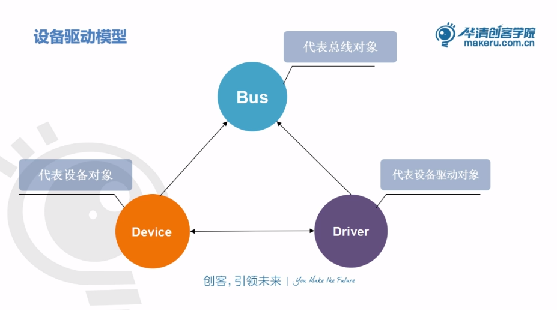

[参考](https://blog.csdn.net/set_mode/article/details/92845858)

非特殊说明情况下，本文讨论的**设备**皆为**字符设备**，**驱动**皆为**字符设备驱动**。**总线**表示一个**内核代码结构体对象**而不是物理意义上的总线。

# 字符设备驱动开发流程

首先做如下总结

1. 实现入口函数xxx_init()和卸载函数xxx_exit()
2. 申请设备号 alloc_chrdev_region()
3. 初始化cdev_init(), 注册cdev_add(), 创建类和节点class_create(), device_create()
4. 硬件部分初始化
   - 查阅datasheet获取寄存器地址：基地址 + 偏移量 
   - 映射虚拟寄存器地址ioremap()
   - 注册中断
   - ……
5. 实现设备文件IO操作方法
   - 前面第三步已经通过 cdev_init 建立cdev与 file_operations之间的连接
   - 实现xxx_open(), xxx_release(), xxx_read(), xxx_write()等接口


以上5步是开发一个字符设备驱动的基本流程，不难看出，前3步的流程都是固定的，第5步也有一定的共性，不外乎就是对寄存器进行读写操作，唯一不同的是第四步，因为每个设备的的寄存器地址不一样。

如果板子接了10个摄像头，每个摄像头型号分辨率等参数不一样，难道做驱动开发的时候要把以上5步重复开发10次吗？那代码利用率也太差了吧！

有没有可能对1.2.3.5步这些通用性高的代码和第4步的代码分开，避免重复且不必要的开发？

——引入设备驱动模型


# 设备驱动模型

内核定义了一个完整的驱动架构，在这个驱动架构下，我们只需要关心驱动和设备本身，至于驱动的加载，设备和驱动的匹配等都由内核处理。

设备驱动模型把代码分成三部分：

- Device设备对象

  - 描述设备信息，相当于前面驱动开发中的第4步
  - 包含寄存器地址，中断等信息
  - 设备对象注册到Bus的Device链表

- Driver驱动对象

  - 描述设备操作，相当于前面驱动开发中的第5步
  - 只要给我不同的地址不同的中断，我就可以驱动不同的设备
  - 驱动对象注册到Bus的Driver链表

- Bus总线对象

  - **并不一定与物理上的总线有关系**，暂且将它看作成给设备和驱动“穿针引线”的虚拟中介
  - 核心任务是建立驱动和设备的关系
  - 通过name来匹配Driver和Device，成功匹配后，Driver就可以去驱动Device
  - 管理维护Driver链表和Device链表

  



​		

以上只是一个非常理想的模型，实际上没那么简单，设备驱动模型会把相似的驱动进行分类，比如gpio设备，usb设备，spi设备，input设备等等等等。

总线也有很多种I2C总线，USB总线，PCI总线等，这些都是物理总线，为防止混淆，这里最好暂且将它看作是一个虚拟中介，一个辅助数据结构。

那么，如何查看当前linux内核系统有哪些设备，分成了哪些类别，它又是如何管理设备，类别，总线三者之间关系的呢？

——引入sysfs文件系统

# sysfs文件系统

sysfs是一个基于内存的文件系统，用于将设备的层级结构反映到用户空间，用户空间的程序可以通过读取它的文件来获取设备的信息和状态，还可以通过写入它的文件来控制设备等，对程序员debug驱动问题很有帮助。

例：比如我想知道`/dev/input/event0`这个设备节点是干啥用的

首先`cd /sys/class/input/event0`进入目录，可以看到下面有5个文件

```shell
chry@chry-ubuntu20:/sys$ cd /sys/class/input/event0
chry@chry-ubuntu20:/sys/class/input/event0$ ls
dev  device  power  subsystem  uevent
```

然后`cat uevent `，可以查看主次设备号和对应的设备节点，这一步不怎么重要，没得到到啥有用信息

```shell
chry@chry-ubuntu20:/sys/class/input/event0$ cat uevent 
MAJOR=13				主设备号
MINOR=64				次设备号
DEVNAME=input/event0	设备在/dev目录下对应的节点名称
```

接着进入`device`目录，看到以下文件，暂时先关注`name`文件，把它的信息打印出来

```shell
chry@chry-ubuntu20:/sys/class/input/event0$ cd device
chry@chry-ubuntu20:/sys/class/input/event0/device$ ls
capabilities  event0  modalias  phys   properties  uevent
device        id      name      power  subsystem   uniq
chry@chry-ubuntu20:/sys/class/input/event0/device$ cat name 
Sleep Button
chry@chry-ubuntu20:/sys/class/input/event0/device$ 
```

根据`name`显示出来的信息可以看出来这个是一个**休眠按钮**，结案！


暂时先关注以下三个目录：

- `/sys/devices`
  - 层级结构根据设备**分层**展示所有设备信息
  - 其他目录基本是分类组织链接文件，**实际通过链接方式(symlink)指向该目录内容**
  - 直接映射到内核设备树
- `/sys/class`
  - 层级结构根据设备**分类**展示所有设备信息
  - 可以看到设备分成了哪些类别，各类别下有哪些设备
  - 通过class_create()创建的类会显示在这里
  - 通过device_create()创建的节点会显示在对应的类目录下
- `/sys/bus`
  - 层级结构根据**总线类型**展示挂载在各总线上的设备信息，每个子目录都是kernel支持并且已经注册了的总线类型
  - 每个子目录下都有`devices`和`drivers`两个目录
  - `devices`对应上节**设备驱动模型**中的设备对象，描述设备数据信息
  - `drivers`对应上节**设备驱动模型**中的驱动对象，描述设备操作逻辑


sysfs中的bus目录层级在一定程度上验证了上节中说的设备驱动模型，下面进一步学习驱动/设备/总线三者之间的实现原理。

**再次强调，这里讨论的总线bus是物理总线的抽象，是内核代码(设备驱动模型)中一个结构体对象。**

# 实现原理

在内核代码(设备驱动模型)里，用device_driver结构体表示驱动(下面就简称为driver)，device结构体表示设备，bus_type结构体表示总线。

bus_type会包含driver链表和device链表，属于同一个bus_type的driver被插入到driver链表中，属于同一个bus_type的device被插入到device链表中。如此bus_type便实现了两者的间接关系。

driver会包含device链表，probe成功的device会被插入到该链表。

device结构体对象包含driver指针，probe成功时指向匹配的driver。

**如果在bus_type上的driver和device匹配成功，就会调用probe函数。**

匹配成功后可拿到设备对象包含的地址和中断等信息，在probe函数一般实现以下操作：

1. 申请设备号 alloc_chrdev_region()
2. 初始化cdev_init(), 注册cdev_add(), 创建类和节点class_create(), device_create()
3. 硬件部分初始化
   - 映射虚拟寄存器地址ioremap() 
   - 注册中断
   - ……
4. 实现设备文件IO操作方法
   - 前面第三步已经通过 cdev_init 建立cdev与 file_operations之间的连接
   - 实现xxx_open(), xxx_release(), xxx_read(), xxx_write()等接口

*熟悉的味道，熟悉的配方，没错，probe函数里面实现也就是最最开始时学习字符设备驱动开发的基础流程。*

## probe是如何被调用的

两种情况，加载驱动的时候(开机/insmod)，注册设备的时候(开机/插入usb/hdmi等设备)。

### 加载驱动

1. 初始化driver结构体，将driver结构体插入到bus_type的driver链表

2. 遍历bus_type的device链表，进行以下操作：

   - 调用bus_type->match(device, driver)尝试匹配

     返回值大于0表示匹配成功，没有定义match函数默认匹配成功

   - 如果match成功，并且该device没有绑定其他driver（!device->driver），调用readlly_probe()，在里面先设置device->driver指向driver，然后尝试probe device。

     - 如果调用bus_type定义了probe，bus_typed->probe(device)
     - 否则调用driver->probe(device)，如果driver也没有定义probe，会被当做probe陈成功。

   - 如果probe返回0，配对成功，将device插入到driver的链表中；返回非0表示配对失败，将device->driver置NULL

### 注册设备

1. 初始化device结构体，将driver结构体插入到bus_type的device链表
2. 遍历bus_type的driver链表，操作与加载驱动的情况类似，不做重复。

备注：当bus_type的driver链表的某个driver与device配对成功后，在加载驱动的情况下会继续遍历，而注册设备的情况下就会立马结束遍历，这是因为device与driver是一对一的关系，而driver与device是一对多的关系。

但有时候bus_type的driver链表可能会存在多个driver适合device，应该怎么确保device最终绑定的是期望的那一个driver呢？

解决方案一：调整驱动加载顺序

解决方案二：修改device使它不能与其他driver匹配

## 

了解原理之后就可以开始锤键盘了

# 总线模型编程

​		在开发中我们并不会真的去写一个总线模型，我们分析总线驱动模型是为了搞清楚总线是如何将driver和device匹配的，即当我们插入我们的设备时，总线是如何找到这个设备对应的驱动，并且调用驱动的probe函数的。不管是先有驱动后有设备、还是先有设备后有驱动。都会调用驱动driver中的probe，而不是设备device。

​		一般情况下，我们都是在kernel中已有的总线上去开放设备驱动程序，如 usb_bus_type、spi_bus_type、pci_bus_type、platform_bus_type、i2c_bus_type 等，内核中已经实现了这些总线的总线驱动，我们只需实现设备device和驱动driver。

------

下面从0开始实现总线模型，详见bus_demo文件夹。

里面包括3个源文件:

chrybus_demo.c

chrydev_demo.c

chrydrv_demo.c

分别实现上文里面的总线/设备/驱动代码.
代码上的分离，使用时要合在一起
测试方法：

```shell
sudo insmod chrybus_demo.ko;sudo insmod chrydev_demo.ko;sudo insmod chrydrv_demo.ko;

dmesg;sudo dmesg -C

sudo rmmod chrydrv_demo chrydev_demo chrybus_demo 
```

这便是总线模型最基本最本质的实现，以后我们遇到的i2c总线/spi总线/usb总线/platform总线等，都是遵从这一套模型的。

**此外，在设备驱动模型里，这些总线对象都已经实现了，我们只需要关注设备对象和驱动对象。**

每种类型的总线实现特定功能，相对于USB、PCI、I2C、SPI等物理总线来说，platform总线是一种虚拟、抽象出来的总线，实际中并不存在这样的总线。同时platform总线也是比较容易理解的总线，下面便从platform总线开始着手学习总线模型编程。

## 平台总线(platform bus)模型

[参考](https://www.cnblogs.com/deng-tao/p/6026373.html)

### 为什么要有平台总线？

在日常项目产品开发中，更换soc是很常见的情形，比如从rk3288升级到rk3399甚至hi3559，那么对于已经在rk3288开发好的驱动（在各平台具有共性的驱动比如gpio，uart驱动等）怎么移植到新的平台呢？

在没有引入platform bus的情况下，往往需要把相似的代码写多遍（每个平台一遍），那就产生了大部分重复代码，举例：

gpio驱动开发逻辑：

1. 配置gpio的输入输出方向——方向寄存器
2. 配置gpio的电平信号——数据寄存器

uart驱动开发逻辑：

1. 配置波特率、停止位、数据位和校验位——xxx寄存器
2. 时序，行控，流控——xxx寄存器


不管在哪个平台，操作逻辑基本都是一样的，唯一不同的就是**寄存器地址**还有**中断号**。

这对一个有信仰的程序员来说是简直就是罪恶！有没有办法仅修改设备而platform bus就为我们解决了这个问题。

platform bus特性：device(中断/地址)和driver(操作逻辑)分离

在更换soc的时候只需要更改device信息即可。

补充：实际上大多数情况下平台总线更适用于相同品牌的soc，因为同样品牌下基地址不一样但是偏移基本一样，而不同品牌的基地址和偏移地址都不一样。当然可以通过一些手段解决，发挥聪明才智即可。

### 数据结构

​		在内核代码(设备驱动模型)里，用device_driver结构体表示驱动(下面就简称为driver)，device结构体表示设备，bus_type结构体表示总线。

前文也提到过，包括platform bus在内，设备驱动模型已经实现了各种常见类型的总线对象，我们**只需要关注设备对象和驱动对象**，所以我们不需要开发platform_bus_type结构体对象，但为了更好理解platform bus，我们应该去了解它具体的实现方式。

#### 总线对象：platform_bus_type

以下是内核中已经定义好的platform bus对象，开机就会初始化：

```c
struct bus_type platform_bus_type = {
    .name		= "platform",
    .dev_groups	= platform_dev_groups,
    .match		= platform_match,
    .uevent		= platform_uevent,
    .pm		= &platform_dev_pm_ops,
};
```

任何总线驱动开发，首先就是要学习它的匹配方法是什么，跟踪platform_match()可知platform bus的匹配规则：

```c
	struct platform_device *pdev = to_platform_device(dev);
	struct platform_driver *pdrv = to_platform_driver(drv);
	// 优先匹配driver里面的id_table，里面包含了所支持的各平台的名称，拿来跟pdev中的名字做匹配
	if (pdrv->id_table)
		return platform_match_id(pdrv->id_table, pdev) != NULL;

	//如果driver里面的id_table为空，则直接匹配driver和device的名字
	/* fall-back to driver name match */
	return (strcmp(pdev->name, drv->name) == 0);
```

平台总线对象不需要我们去开发，了解它的匹配方法之后，我们就可以动手去**实例化**平台设备对象和平台驱动对象了。注意这里是实例化，因为内核代码中已经设计好了这两个对象的方法成员（结构体）。

#### 设备对象：platform_device

```c
struct platform_device {           //platform总线设备
    const char    * name;          //平台设备的名字
    int        id;                 // ID 是用来区分如果设备名字相同的时候(通过在后面添加一个数字来代表不同的设备，因为有时候有这种需求) 不用时置为-1
    struct device    dev;          // 内置的device结构体 继承了device父类
    u32        num_resources;      // 资源结构体数量 可以有多个寄存器地址或中断信息
    struct resource    * resource; // 指向一个资源结构体数组 用来描述设备的寄存器地址或中断信息
    const struct platform_device_id    *id_entry; //用来进行与设备驱动匹配用的id_table表  
    /* arch specific additions */
    struct pdev_archdata    archdata;         //自留地    添加自己的东西
};

注册和注销
	int platform_device_register(struct platform_device *dev);
	void platform_device_unregister(struct platform_device *dev);

设备资源结构体
#include<linux/ioport.h>
struct resource {
	resource_size_t start;
	resource_size_t end;
	const char *name;		//描述 自定义
	//flags区分当前描述的是内存(IORESOURCE_MEM)/中断(IORESOURCE_IRQ)/寄存器等等等等资源
	unsigned long flags;	
	struct resource *parent, *sibling, *child;	//可以看出是树状存储结构，不需关注，系统会搞定的
};
```

#### 驱动对象：platform_driver

```c
struct platform_driver {
    int (*probe)(struct platform_device *);     //这个probe函数其实和  device_driver中的是一样的功能，但是一般是使用device_driver中的那个
    int (*remove)(struct platform_device *);    //卸载平台设备驱动的时候会调用这个函数，但是device_driver下面也有，具体调用的是谁这个就得分析了
    void (*shutdown)(struct platform_device *);
    int (*suspend)(struct platform_device *, pm_message_t state);
    int (*resume)(struct platform_device *);
    struct device_driver driver; 	//内置的device_driver 结构体  继承了device_driver父类
    const struct platform_device_id *id_table;  //该设备驱动支持的设备的列表  他是通过这个指针去指向  platform_device_id 类型的数组
};

注册和注销  
	int platform_driver_register(struct platform_driver *drv);
	void platform_driver_unregister(struct platform_driver *drv);
```

------

platform_device结构体继承了device父类，platform_driver结构体继承了device_driver父类，在注册设备和驱动对象时，它们的bus已经指定为platform_bus_type，不需要我们手动指定。

另外，注册时实际上是把**父类**注册到platform_bus_type的两条链表中。

那么如何通过结构体变量中某个成员的首地址进而获得整个结构体变量的首地址？

linux中提供了`container_of`宏，该宏定义在include/linux/kernel.h中

```c
#define container_of(ptr, type, member) ({	    \
	const typeof( ((type *)0)->member ) *__mptr = (ptr);    \
	(type *)( (char *)__mptr - offsetof(type,member) );})
```

[container_of原理看这里](https://blog.csdn.net/npy_lp/article/details/7010752)

前面`platform_match()`函数里面的`to_platform_device()`和`to_platform_driver()`就是对container_of宏进行封装而来。

### 进入编码环节

开发rk3288平台下的gpio驱动

platform_gpiodev.c

platform_gpiodrv.c

分别实现gpio设备/驱动代码.
测试方法：

```shell
sudo insmod platform_gpiodev.ko;sudo insmod platform_gpiodrv.ko;

dmesg;sudo dmesg -C

sudo rmmod platform_gpiodev platform_gpiodrv  
```

