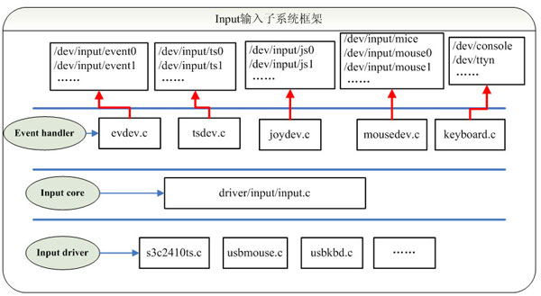

# 输入子系统

总线帮助我们解决了设备对象与驱动对象的分离，平台总线进一步帮助我们解决了**同一个设备对象**在不同SOC平台下的寄存器/中断等芯片信息的差异化处理。

那么，如果一个板子同时接了3个不同型号的键盘，怎么办？即使我们在设备驱动模型行编程，这种情况依然要分别开发3组设备对象和驱动对象（当然，这是在还不知道输入子系统的情况下）。

为了节省开发量，我们需要进一步提取这些不同类型输入设备驱动之间的共性和差异，从驱动代码的角度来看，输入设备驱动只做以下两件事情：

- 获取到数据
- 上报给用户

其中获取数据就是操作硬件，这部分是差异化的代码；而上报给用户就是实现xxx_read，阻塞，copy_to_user等操作逻辑，有很大的共性。

于是linux内核实现了输入子系统框架，规范统一了输入设备的驱动编程方法，同时也统一了应用开发的接口。


# 框架

首先输入子系统把输入设备进行分类：keyboard键盘，mouse鼠标，touchscreen触摸屏，joystick游戏杆等等。

在应用层和硬件层之间，输入子系统把驱动分为事件层/核心层/驱动层：

应用层

---------------------------------------

事件层	event handler： III创建节点文件，注册到input handler链表，实现fops操作，将数据交给用户

---------------------------------------

核心层	input core： I申请设备号(固定为13)，II创建类，维护input device链表和input handler链表

---------------------------------------

驱动层	input device： 抽象成对象，注册到input device链表，IV初始化硬件，获取到数据交给input handler

---------------------------------------

硬件层




驱动开发input device部分代码即可。

应用操作接口：/dev/input/event0，event1，mouse0。。。

open(/dev/input/event0),

read(fd, `struct input_event`)


# 编程

首先保证内核源码目录`drivers/input/`下中有以下文件：

`input.c `是input core层的实现

` evdev.c`是event handler层的实现

同时`make menuconfig`查看内核配置，确保输入子系统选项打开

```
Device Drivers  --->
	Input device support --->
		-*- Generic input layer (needed for keyboard, mouse, ...)				通用输入层input core
		<*> Event interface																						 	   event handler层
```

万事俱备，进入编码环节。。。简单实现一个input device。

使用输入子系统方式实现按键驱动:

```
input_subsystem/simple_input_drv.c
```

测试：

```shell
chry@ubuntu:~/codes/driverdemo/input_subsystem$ ls /dev/input/
by-id  by-path  event0  event1  event2  event3  event4  mice  mouse0  mouse1  mouse2
chry@ubuntu:~/codes/driverdemo/input_subsystem$ sudo insmod simple_input_drv.ko 
chry@ubuntu:~/codes/driverdemo/input_subsystem$ ls /dev/input/
by-id  by-path  event0  event1  event2  event3  event4  event5  mice  mouse0  mouse1  mouse2
```

可以看到，在代码没有注册设备号的情况下，`/dev/input/`目录下新增加了节点`event5`。

## input_dev 结构体

input_dev表示一个具体的输入设备，在linux/input.h中定义，这里仅仅注释了比较必要的项：

```c
struct input_dev {      
    // 下面4项是sysfs中给用户看的信息
	const char *name;   		// cat /sys/class/input/event0/device/name
	const char *phys;			//cat /sys/class/input/event0/device/phys	描述物理特性，丝印？随便写
	const char *uniq;
	struct input_id id;

/*
evbit实际表示一个位表，描述输入设备能够产生什么类型的数据
#define EV_SYN			0x00	//表示同步数据类型
#define EV_KEY			0x01	//表示按键数据类型
#define EV_REL			0x02	//表示相对坐标数据类型
#define EV_ABS			0x03	//表示绝对坐标数据类型

#define EV_MSC			0x04	//表示杂项
#define EV_SW			0x05	//开关
#define EV_LED			0x11	//LED指示数据
#define EV_SND			0x12	//声音数据
... ...
*/
	unsigned long evbit[BITS_TO_LONGS(EV_CNT)];     
 /*
EV_KEY	按键/keyboard: 产生键值,实际是一个数字
            #define KEY_A			30
            #define KEY_S			31
            #define KEY_D			32
            #define KEY_F			33
       	 	... ...
*/
	unsigned long keybit[BITS_TO_LONGS(KEY_CNT)];
/*
EV_ABS		ts/gsensor: 产生绝对坐标，并且原点(0,0),最大值(800,480)
            #define ABS_X			0x00
            #define ABS_Y			0x01
			#define ABS_PRESSURE		0x18
        .....多点触摸等等
*/
	unsigned long relbit[BITS_TO_LONGS(REL_CNT)];
/*
3.EV_REL	mouse: 产生相对坐标，相对于之前点的坐标 EV_KEY
            #define REL_X			0x00
            #define REL_Y			0x01
       	 	... ...
*/
	unsigned long absbit[BITS_TO_LONGS(ABS_CNT)];
	unsigned long mscbit[BITS_TO_LONGS(MSC_CNT)];
	unsigned long ledbit[BITS_TO_LONGS(LED_CNT)];
	unsigned long sndbit[BITS_TO_LONGS(SND_CNT)];
	unsigned long ffbit[BITS_TO_LONGS(FF_CNT)];
	unsigned long swbit[BITS_TO_LONGS(SW_CNT)];
/*
    //以上都是位表，使用__set_bit将对应位置1表示该功能生效 最高支持768位 使用24个long即可表示出来 24*32=768
     __set_bit(KEY_POWER, simple_input_dev->keybit); 
     //等价于： 
     simple_input_dev->keybit[BIT_WORD(KEY_POWER)] |= BIT_MASK(KEY_POWER);
    即：simple_input_dev->keybit[116/32] |= 1 << 116 % 32;
    这两种方式都可能在内核代码中出现，知道原理作用即可，推荐前者
*/
	... ... 
        
	struct device dev;		//继承device对象 静态概念 名词 描述性概念    
	struct list_head	h_list;		//表示input handler链表
	struct list_head	node;	//表示input device链表  输入子设备注册后会加入到该列表

}；
```

## 键值、坐标上报函数

```c

//===============================================
//上报数据的方法
/*
上面一堆注释里面，对应到input_event函数的参数：
type：数据类型，对应有EV_XXX
code：键值或坐标轴等，KEY_XXX/ABS_XXX/REL_XXX等
value：按键抬起放下状态或坐标值 
*/
void input_event(struct input_dev *dev, unsigned int type, unsigned int code, int value);

static inline void input_report_key(struct input_dev *dev, unsigned int code, int value)
{
    // !!value的作用：不是0就是1不会出现其他数值
	input_event(dev, EV_KEY, code, !!value);
}

static inline void input_report_rel(struct input_dev *dev, unsigned int code, int value)
{
	input_event(dev, EV_REL, code, value);
}

static inline void input_report_abs(struct input_dev *dev, unsigned int code, int value)
{
	input_event(dev, EV_ABS, code, value);
}
... ... 
```

在初始化input_dev的时候就必须声明这个子设备能够产生什么类型的数据type，和这个类型数据中具体的code。使用`__set_bit`指定。


## 驱动多个按键

一个按键有多个与其相关的元素：

- 中断号
- 按键状态 -- 从gpio的输入数据寄存器读取
- 键值 -- code

在设备树中设置以上元素：

一般情况下，在dts定义gpio之后，然后在代码中就可以根据gpio获取中断号和读取gpio的值，再定一下键值就可以满足以上要素了。

```
/ {
	chry_multi_key_node {
		compatible = "chry_multi_key";
		key_irq@0 {
			key_name = "key_gpio0a7";
			key_code = <12>;
			gpio = <&gpio0 7 GPIO_ACTIVE_HIGH>;			////使用of_get_named_gpio(cnp, "gpio", 0);获取
			//gpios = <&gpio0 7 GPIO_ACTIVE_HIGH>;		//使用of_get_gpio(cnp, 0)获取
		};
		
		key_irq@1 {
			key_name = "key_gpio0b1";
			key_code = <8>;
			gpio = <&gpio0 9 GPIO_ACTIVE_HIGH>;
		};
	};
};
```


然后在代码中设计这几个元素:

```

    //1.获取到设备树中的chry_multi_key_node节点
    struct device_node *np = of_find_node_by_path("/chry_multi_key_node");
    
    2.获取它下面的子节点key_irq@0，key_irq@1 ... ... 
struct device_node *of_get_next_child(np, struct device_node *prev);
```


